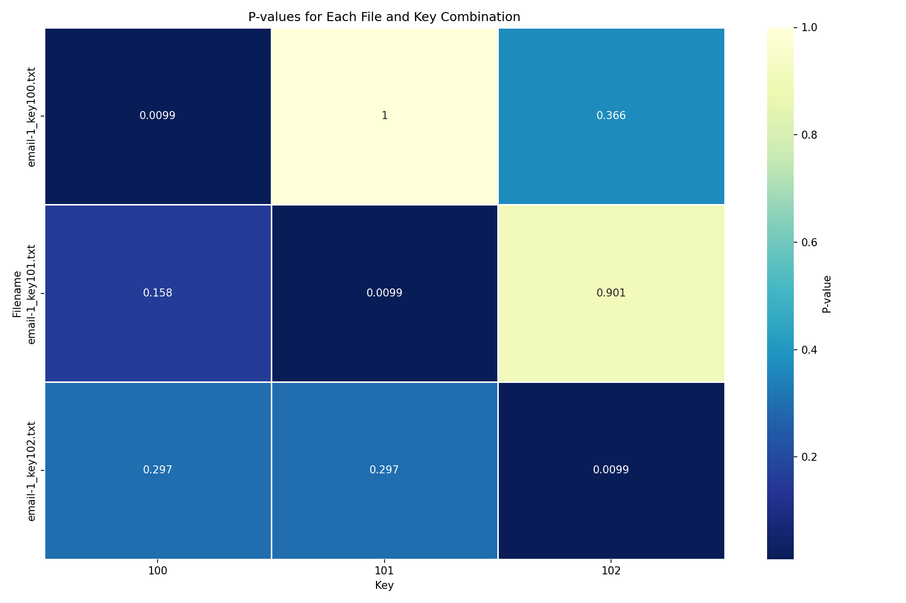

# Watermark Detection Analysis Report

## Summary

- Files analyzed: 3
- Keys tested: [100, 101, 102]
- Correct identifications: 3 out of 3
- Accuracy: 100.00%

## Visualization

P-values heatmap for each file and key combination:

*Lower p-values (darker colors) indicate stronger evidence of watermarking with that key.*

## Detailed Results

### email-1_key101.txt

- Actual key: 101
- Detected key: 101
- Correct identification: Yes

#### P-values for each key

|   Key |   P-value |
|------:|----------:|
|   100 |  0.158416 |
|   101 |  0.009901 |
|   102 |  0.90099  |

The key with the lowest p-value is: **101**

✅ Correctly identified the watermark key.

### email-1_key100.txt

- Actual key: 100
- Detected key: 100
- Correct identification: Yes

#### P-values for each key

|   Key |   P-value |
|------:|----------:|
|   100 |  0.009901 |
|   101 |  1        |
|   102 |  0.366337 |

The key with the lowest p-value is: **100**

✅ Correctly identified the watermark key.

### email-1_key102.txt

- Actual key: 102
- Detected key: 102
- Correct identification: Yes

#### P-values for each key

|   Key |   P-value |
|------:|----------:|
|   100 |  0.29703  |
|   101 |  0.29703  |
|   102 |  0.009901 |

The key with the lowest p-value is: **102**

✅ Correctly identified the watermark key.

